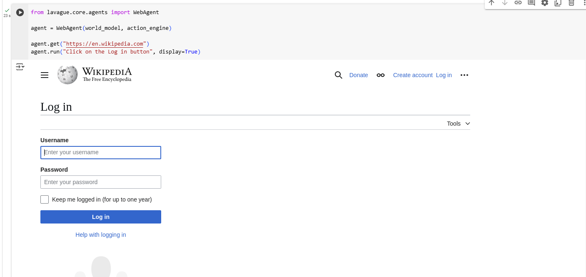

# Lavague Project

This repository contains a notebook that uses the `lavague` library to perform advanced tasks with language models and data processing in applications. It includes configurations to interact with the OpenAI API.

  
*Figure: Project overview showcasing the main workflow.*

## Features

The notebook includes the following functionalities:

- **Environment Setup**: Installation and configuration of the `lavague` library along with required dependencies.
- **API Integration**: Connecting to the OpenAI API with an environment variable for secure access.
- **Data Processing and Automation**: Examples on how to use `lavague` to manage language inputs, process data, and automate tasks using natural language models. Open wikipedia page and click in "Log in" button.

## Requirements

- Python 3.10 or later
- OpenAI API key (for tasks that require API access)

## Installation

1. Clone this repository:
   ```bash
   git clone https://github.com/yourusername/lavague-project.git
   cd lavague-project
   ```

2. Install the dependencies by running:
   ```bash
   pip install -r requirements.txt
   ```

   > **Note:** If running in Google Colab, you can install `lavague` directly in a cell:
   ```python
   !pip install lavague
   ```

## Configuration

1. **OpenAI API Key**: If using the notebook in Google Colab, set up the API key in Colab’s secrets:
   - Click the key icon on Colab's sidebar.
   - Add a secret named `OPENAI_API_KEY` with your OpenAI key.

   Then, set the environment variable in the notebook:
   ```python
   import os
   os.environ["OPENAI_API_KEY"] = "<YOUR_API_KEY>"
   ```

## Usage

Run the cells in the `main.ipynb` file to explore examples of using `lavague` with language models. You can customize parameters and adapt the code according to your needs.

## Contributing

If you’d like to contribute to this project, please open an Issue or Pull Request in this repository.

## License

This project is licensed under the MIT License.
